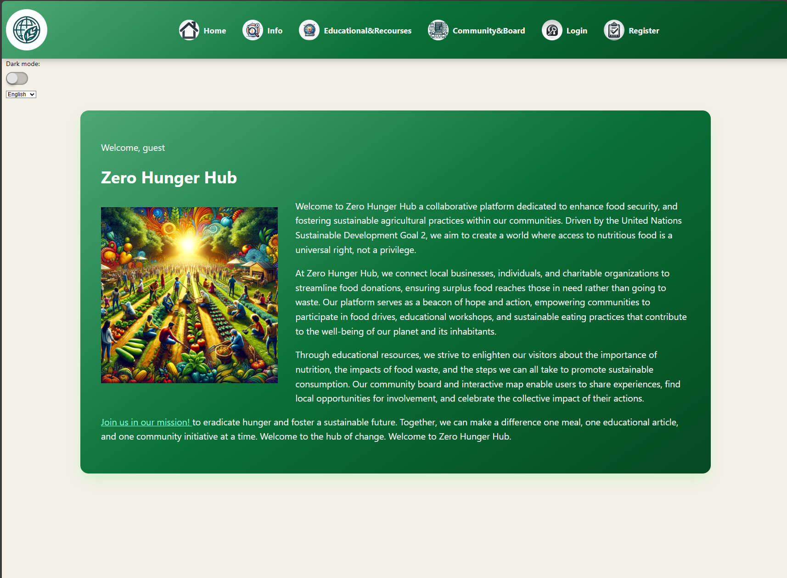

# Zero Hunger Hub

## Overview

The Donation Management System is a web application designed to manage the donation of items. Users can register, login, add donation items, view listed items, and manage their own donations.

## Project Structure

The project structure is organized as follows:

```
src/
├── backEnd/
│ ├── controller/
│ │ ├── CommunityBoardController.js
│ │ ├── dataBaseController.js
│ │ ├── donationItemController.js
│ │ └── userController.js
│ ├── middlewares/
│ │ ├── actionHandler.js
│ │ └── validator.mjs
│ ├── models/
│ │ ├── communityBoard.mjs
│ │ ├── dataBase.mjs
│ │ ├── donationItem.mjs
│ │ └── user.mjs
│ └── routes/
│ └── userRouter.mjs
├── frontEnd/
│ ├── css/
│ ├── images/
│ └── views/
│ ├── add-donation-item.ejs
│ ├── communityBoard.ejs
│ ├── donation-listing.ejs
│ ├── edit-donation-item.ejs
│ ├── edu-recommendation.ejs
│ ├── error.ejs
│ ├── flashMessage.ejs
│ ├── head.ejs
│ ├── header.ejs
│ ├── home.ejs
│ ├── info-page.ejs
│ ├── login.ejs
│ ├── profile.ejs
│ ├── profileUpdate.ejs
│ └── register.ejs
├── .editorconfig
├── .eslintrc.cjs
├── .gitignore
├── .jsdoc.json
├── .stylelintrc.cjs
├── index.js
├── package-lock.json
├── package.json
├── README.md
└── vite.config.js
```

## Backend

### Controllers

- **CommunityBoardController:** Handles operations related to the community board.
- **dataBaseController:** Manages database interactions and operations.
- **donationItemController:** Manages donation items, including adding, editing, viewing, and removing items.
- **userController:** Handles user authentication, registration, profile management, and user-related operations.

### Middlewares

- **actionHandler.js:** Handles actions for routes.
- **validator.mjs:** Validates request data.

### Models

- **communityBoard.mjs:** Defines the schema and methods for community board data.
- **dataBase.mjs:** Defines the schema and methods for database interactions.
- **donationItem.mjs:** Defines the schema and methods for donation items.
- **user.mjs:** Defines the schema and methods for user data.

### Routes

- **userRouter.mjs:** Defines user-related routes and links them to the respective controllers.

## Frontend

### CSS

Contains stylesheets for the application.

### Images

Contains image assets used in the application.

### Views

Contains EJS templates for rendering the frontend pages:
- `add-donation-item.ejs`: Form for adding donation items.
- `communityBoard.ejs`: Displays the community board.
- `donation-listing.ejs`: Lists all donation items.
- `edit-donation-item.ejs`: Form for editing donation items.
- `edu-recommendation.ejs`: Displays educational recommendations.
- `error.ejs`: Error page template.
- `flashMessage.ejs`: Flash message template.
- `head.ejs`: Head section of HTML.
- `header.ejs`: Header section of HTML.
- `home.ejs`: Home page template.
- `info-page.ejs`: Information page template.
- `login.ejs`: Login form.
- `profile.ejs`: User profile page.
- `profileUpdate.ejs`: Form for updating user profile.
- `register.ejs`: Registration form.

## Environment Variables (.env)
The following environment variables need to be set for the application to run:
- `MONGO_URI`: The URI for connecting to the MongoDB database.

### Prerequisites
- Node.js and npm installed on your system. https://nodejs.org/en/download/prebuilt-installer/current
- MongoDB instance running. https://www.mongodb.com/docs/manual/administration/install-community/ or You can use it online https://www.mongodb.com/

### Installation

1. Clone the repository: git@gitlab.lnu.se:tn222sg/project-course-in-software-engineering.git
2. Install dependencies: npm install
3. Create a .env file in the root directory and add your environment variables: MONGO_URI=your_mongodb_uri
4. Run the application: npm start


# Usage
- Register: Users can register by providing their details.
- Login: Users can login using their credentials.
- Add Donation Item: Logged-in users can add new donation items.
- Edit Donation Item: Users can edit items they have added.
- Delete Donation Item: Users can delete items they have added.

# Contributing
Contributions are welcome! Please fork the repository and submit a pull request for any improvements or bug fixes.